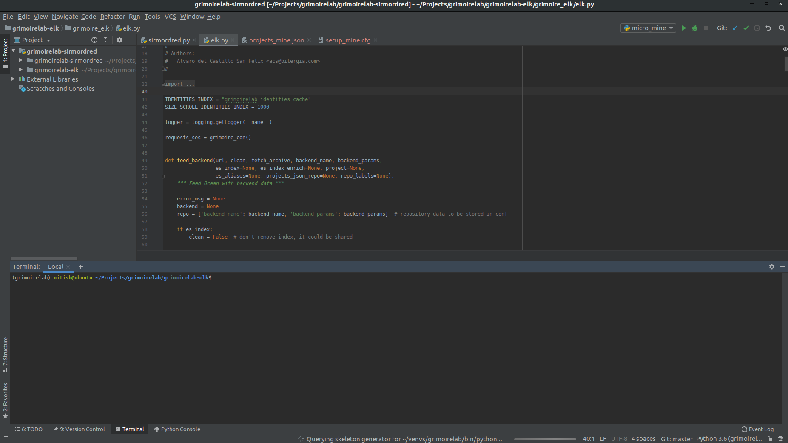

# Microtask 0
Download PyCharm and get familiar with it (for instance, you can follow this tutorial).

## Steps
* Downloaded PyCharm tarball (.tar.gz) from [here](https://www.jetbrains.com/toolbox-app/).

* Extracted the downloaded tarfile by `tar -xzf tarfile`.

* Went through a quick walkthrough from the official website [guide](https://www.jetbrains.com/help/pycharm/quick-start-guide.html).

* Good to go.

