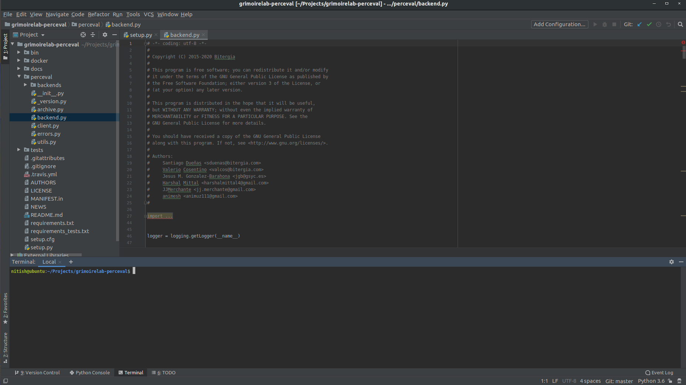
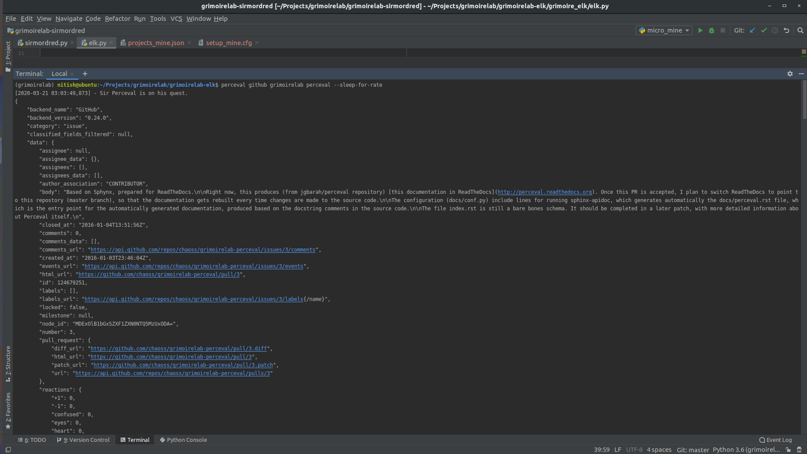

# Microtask 1:
Set up Perceval to be executed from PyCharm.

## Steps to follow

1. Clone the [grimoirelab-perceval](https://github.com/chaoss/grimoirelab-perceval) repository.

2. Prepare a virtualenv to install and manage all packages separate from other projects. 
```
$ python3 -m venv ~/venvs/grimoirelab
$ source ~/venvs/grimo/bin/activate
```
The above commands create and activate a virtual environment in the `~/venvs/grimoirelab` directory.

3. Install all the requirments for Perceval.
```
$ pip3 install -r requirements.txt
$ pip3 install -r requirements_tests.txt
$ pip3 install -e .
```

4. Open Perceval using PyCharm and set interpreter as the virtual environment created above.
	
	
 
5. Run Perceval for the first time on the `perceval` repository using the command.
   
	`perceval github grimoirelab perceval --sleep-for-rate`

	

   Additional arguments for running perceval can be found on the [grimoirelab tutotial](https://chaoss.github.io/grimoirelab-tutorial/perceval/github.html) page