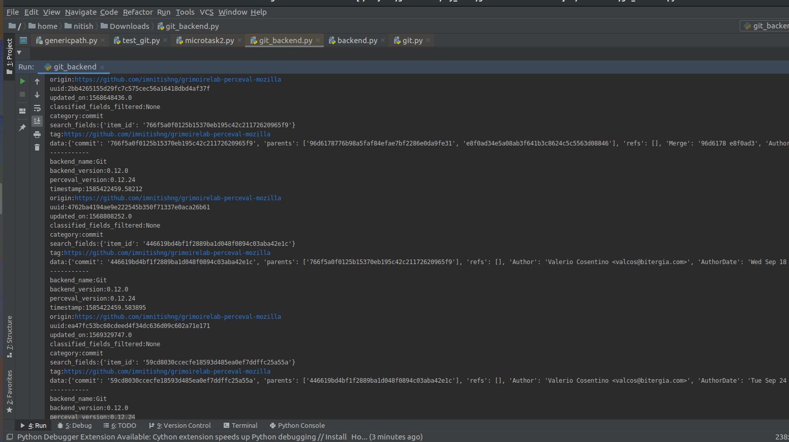
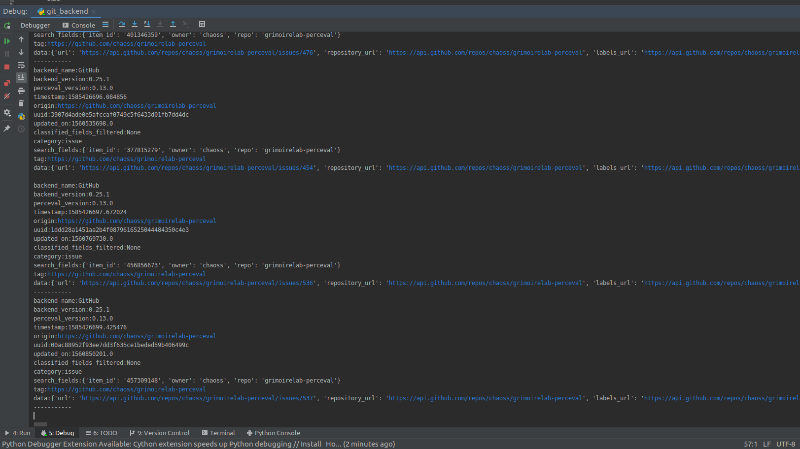

# Microtask 1:
Create a Python script to execute Perceval via its Python interface using the Git and GitHub backends. Feel free to select any target repository.

## Git Backend

* `git_backend.py` is the script to execute Perceval on Git backend.

* Script supports dumping extracted JSON data to a file or printing it to terminal.

* From date and to date is also supported.

* A few parameters for running the script are defined below.

```
-r, --repo = "Git repository URI"
-p, --gitpath = "Gitpath of the repository"
-d, --create_dump = "y/n for creating JSON data dumps"
```

Sample usage
```
python3 git_backend.py -r https://github.com/imnitishng/grimoirelab-perceval-mozilla -p grimoirelab-perceval-mozilla -d y
```
Sample output can be found at `git_commits.json`.

Sample terminal output.




## Github Backend

* `github_backend.py` is the script to execute Perceval on Git backend.

* Script supports dumping extracted JSON data to a file or printing it to terminal.

* From date and to date is also supported alongwith Github Issues and PRs.

* A few parameters for running the script are defined below.

```
-r, --repo = "Github owner/repository name"
-t, --token = "Github API token"
-d, --create_dump = "y/n for creating JSON data dumps"
```

Sample usage
```
python3 github_backend.py -r chaoss/grimoirelab-perceval -t <your API token> -d n
```
Sample output can be found at `github.json`.

Sample terminal output.



