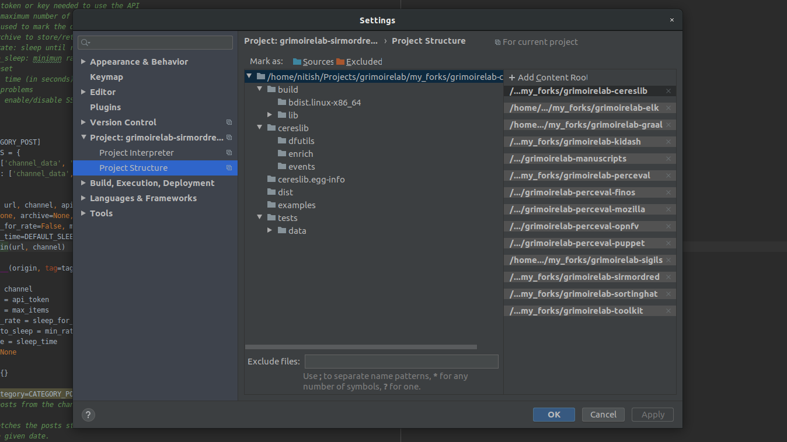

# Microtask 4:
Set up a dev environment to work on GrimoireLab. Have a look to https://github.com/chaoss/grimoirelab-sirmordred#setting-up-a-pycharm-dev-environment.

## Steps -

1. Follow the mentioned [tutorial](https://github.com/chaoss/grimoirelab-sirmordred/blob/master/Getting-Started.md#setting-up-a-pycharm-dev-environment-)

2. Fork all the GrimoireLab repositories mentioned [here](https://github.com/chaoss/grimoirelab-sirmordred/blob/master/Getting-Started.md#setting-up-a-pycharm-dev-environment-)

3. Create a new directory named `sources` and clone all the repositories forked in the above step.
		
		git clone <URL of your forked repository>

4. Create a remote `upstream` to point to the original repository using -

        git remote add upstream https://github.com/chaoss/<name of forked repository>
         
5. Install requirements for all the forked repositories using PyCharm as mentioned [here](https://github.com/chaoss/grimoirelab-sirmordred/blob/master/Getting-Started.md#setting-up-a-pycharm-dev-environment-). 

6. Install the cloned GrimoireLab components from source code by running the following command:
    
        python3 setup.py install
        
7. Add all the GrimoireLab components via `File` -> `Settings` -> `Project` -> `Project Structure`. On right end of window you can use the option `Add Content Root` to add all the components.

### You're good to go now!

