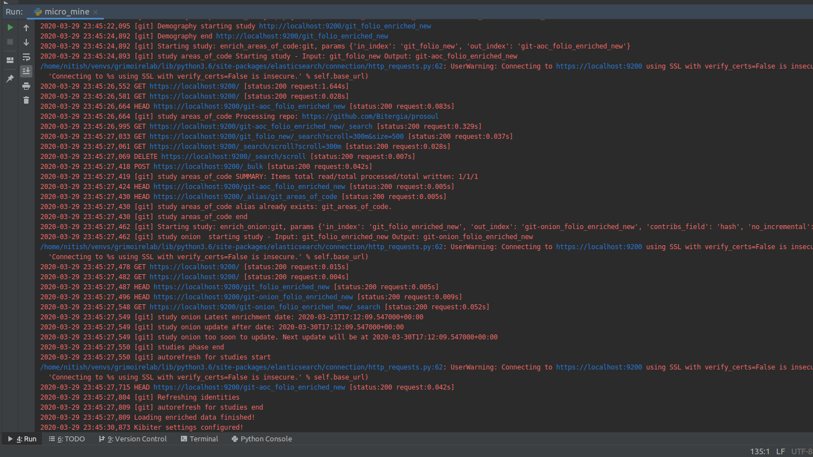

# Microtask 5:

Execute micro-mordred to collect and enrich data from any Git repository.

## Steps to follow

1 . Install MariaDB, Kibiter and Elasticsearch following this [link](https://github.com/chaoss/grimoirelab-sirmordred/blob/master/Getting-Started.md#source-code-and-docker-)

2 . Make configuration (.cfg) and Projects (.json) file for the platforms you want to perform studies on, based on the instructions [here](https://github.com/chaoss/grimoirelab-sirmordred#setupcfg-). 
    You can find my files [here](./files)

3 . Make sure the Kibana and Elasticsearch instances and up and running.

4 . Run micro.py for git backend 
`python3 micro.py --raw --enrich --cfg ./setup.cfg --backends git `
 

Terminal Logs:

