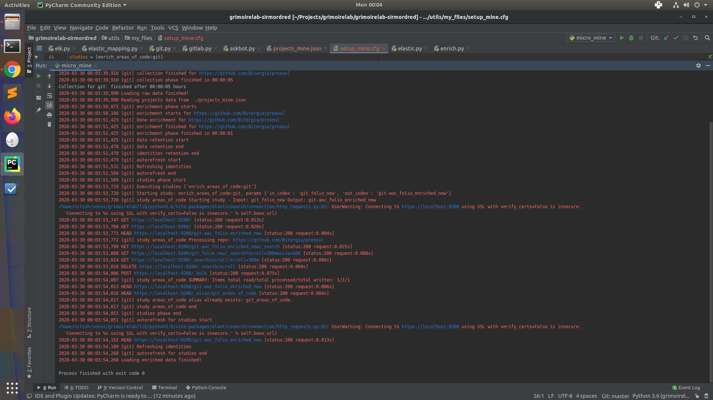
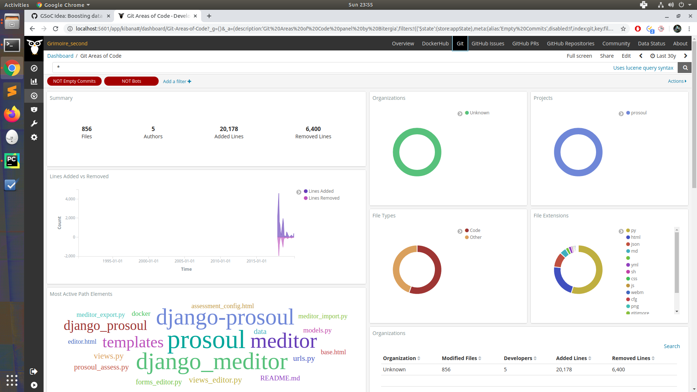

# Microtask 6:

Execute micro-mordred to obtain data from the study enrich_areas_of_code for any Git repository.

## Steps to follow

1 . Make configuration (.cfg) and Projects (.json) file for the platforms you want to perform studies on, based on the instructions [here](https://github.com/chaoss/grimoirelab-sirmordred#setupcfg-). 
    You can find my files [here](./files)

2 . In the studies area for Git add the study for enrich areas-of-code.
```
[git]
raw_index = git_folio_new
enriched_index = git_folio_enriched_new
latest-items = true
category = commit
studies = [enrich_areas_of_code:git]
```

4 . Run micro.py for git backend 
`python3 micro.py --raw --enrich --panels --cfg ./setup.cfg --backends git `
Specify the parameter `--panels` for Kibana dashboards.
 

Terminal Logs:



Kibiter Dashboard:




