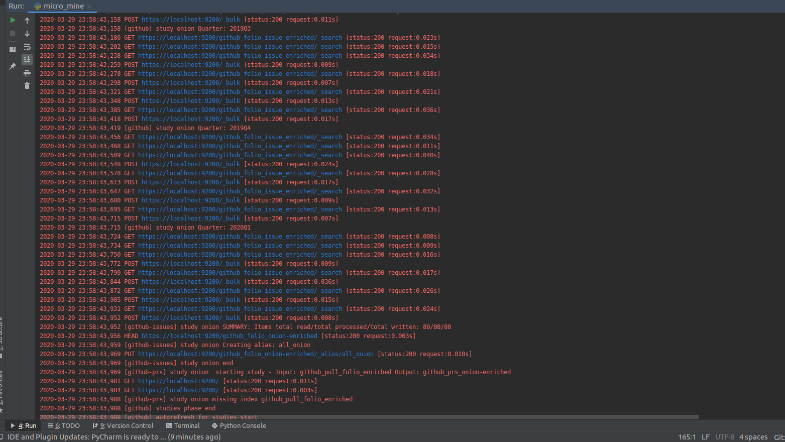

# Microtask 7:

Execute micro-mordred to collect and enrich data from any GitHub repository, making sure that no archives are created by Perceval.

## Steps to follow

1 . Make configuration (.cfg) and Projects (.json) file for the platforms you want to perform studies on, based on the instructions [here](https://github.com/chaoss/grimoirelab-sirmordred#setupcfg-). 
    You can find my files [here](./files)

2 . Make sure the Kibana and Elasticsearch instances and up and running.

3 . Run micro.py for Github backend 
`python3 micro.py --raw --enrich --cfg ./setup.cfg --backends git`

Terminal Logs:

