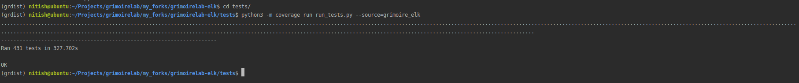

# Microtask 8

In your machine, run the tests for ELK within PyCharm. If you succeed, you can try to run the coverage package on the ELK tests and report the details of each file.

## Steps -

1. Make sure you have setup the GrimoireLab-ELK correctly with all of its dependencies.

2. Start your Elasticsearch and Kibiter instances.

3. Create the databases `test_sh` and `test_projects` in your MySQL instance.
	
		docker exec -i <container id> mysql -u root -e "create database test_sh

4. Populate `test_projects` datbase with `test_project.sql` file using 
		
		mysql -u root test_projects < tests/test_projects.sql

5. Intall coveralls for python using pip in your virtual environment

		pip3 install coveralls

6. Tests can be run individually or for the whole GrimoireLab-ELK 

### To run tests for a particular backend (Git in this case) use 

		python3 -m coverage run test_git.py

 Test running logs -

### To run all the tests use  
	
		python3 -m coverage run run_tests.py --source=grimoire_elk 

Test running logs -

For viewing the coverage reports of the tests type -
		
		python3 -m coverage report -m

My test coverage reports for each file can be found [here](./test_res.txt).
